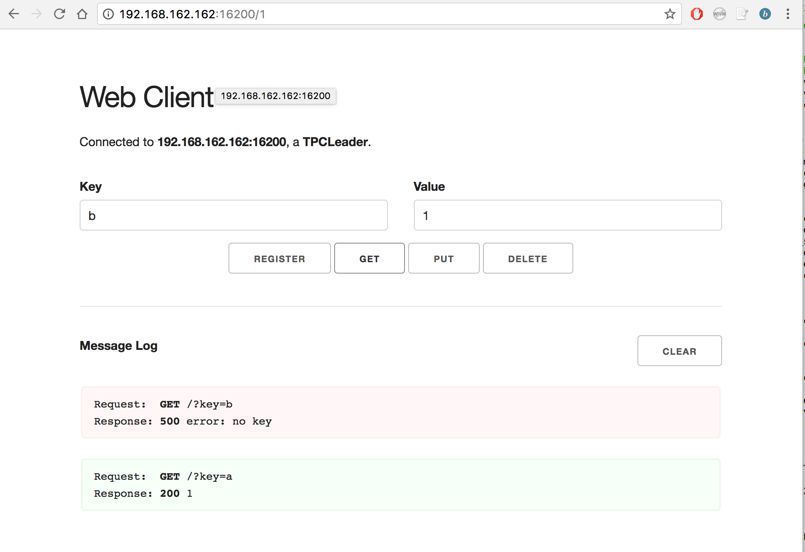

# Key-Value Store

## Table of Contents
* [Introduction](#Introduction)
	* [Two-Phase Commit](#2pc)
		* [Fault Tolerance with Consistent Hashing](#fault)
	* [Crash Recovery](#crash)
* [Project Layout](#layout)
	* [Socket Server](#socket)
	* [TPCFollower](#tpcfollower)
	* [TPCLeader](#tpcleader)
	* [WorkQueue](#workq)
* [HTTP API](#api)
	* [Web Client Interface](#webinterface)
* [Running the Project](#running)
	* Vagrant and Virtual Machine Environments

## Introduction <a name="introduction"></a>
In this project I'm building a distributed NoSQL distributed datastore known as Key-Value Store. As with any database system, it provides the following key operations: get, put and delete. To ensure data integrity, data will be replicated across multiple follower servers. At the same time, there will be a leader server to coordinate actions across the follower servers.

### Two-Phase Commit <a name="2pc"></a>
Two-phase commit, often abbreviated as 2PC, is a protocol that is usually used in transaction processing, databases and computer networking.

#### Fault Tolerance <a name="fault"></a>
To achieve this (data will not be lost even when a follower server fails), we need to replicate data across several machines. We follow the Consistent Hashing scheme here.

### Crash Recovery <a name="crash"></a>
The above (fault tolerance) will work if the follower server has already saved its fully commited transactions on the filesystem. However, the system will lose data if the server crashes in *during* the transaction. As such, we need to *store the states of the servers in a log* so that we can restore the crashed servers.

## Project Layout <a name="layout"></a>

### Socket Server <a name="socket"></a>
It uses `connect_to` to connect a client socket to a listening server socket.

### TPCFollower <a name="tpcfollower"></a>
A follower accepts incoming HTTP requests on a socket using the API below. It does so by processing KVRequest and then provide a KVResponse as appropriate. Details can be found in `tpcfollower_handle_tpc` in the `/main` directory.

### TPCLeader <a name="tpcleader"></a>
The leader is the main point of contact for all the clients. Its main function is to relay API requests to the appropriate followers. More details in `tpcleader_handle_get`.

### Work Queue <a name="workq"></a>
It is a synchronized queue that stores client requests waiting to be processed. 

## API <a name="api"></a>
The user/client can interact (access and/or modify) the database using the following API. Internally, these API
requests and responses are unmarshalled into the C struct types kvrequest_t and kvresponse_t respectively.

| Request            | HTTP Request           | KV Request  |
| :-----------------:|:----------------------:| :----------:|
| Get                | GET /?key=`<key>`      | type: GETREQ |
| Put                | PUT /?key=`<key>&val=<value>` | type: PUTREQ |
| Delete             | DELETE /?key=`<key>` | type: DELREQ |
| Commit Transaction | POST /commit | type: COMMIT |
| Abort Transaction  | POST /abort  | type: ABORT |
| Register Follower  | POST /register?key=`<addr>&val=<port>`| type: REGISTER|

### Web Interface <a name="webinterface"></a>
This is how the interface for TPCLeader Server looks like:


This is how the interface for TPCFollower Server looks like:



## Running <a name="running"></a>
To run this project, you need to install both Vagrant and VirtualBox. Once that's done, `ssh` into your Vagrant VM and run:
```
git clone https://github.com/peiyongsim/KeyValueStore
cd KeyValueStore/kvstore
```
Then, use the Makefile to compile binaries into the `bin` directory.

After that, run the TPCLeader using the command below:
```
./bin/tpcleader [port (default=16200)] [followers (default=1)] [redundancy (default=1)]
```
You can start up an individual follower server using the following command:
```
./bin/tpcfollower [follower_port (default=16201)] [leader_port (default=16200)]
```

As mentioned above, there is a web client interface that allows you to interact with the servers using the HTTP API. To do so, open your web browser and navigate to the root path of your server's address (e.g. http://192.168.162.162:16200 for TPCLeader and http://192.168.162.162:16201 (or 16202, 16203, etc.) for TPCFollowers).


